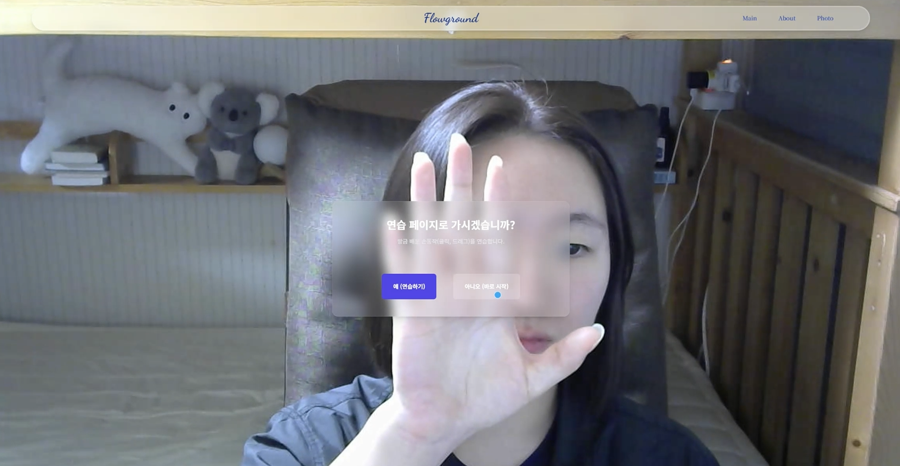
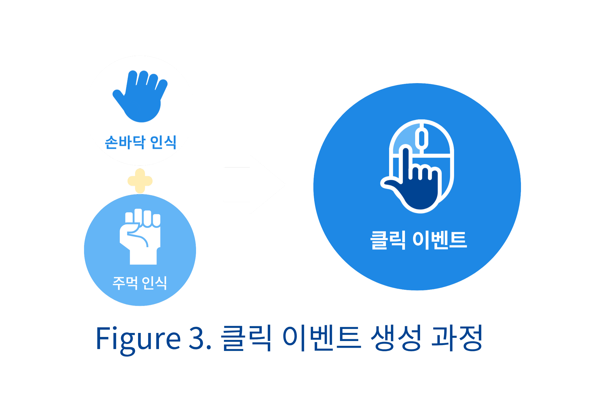
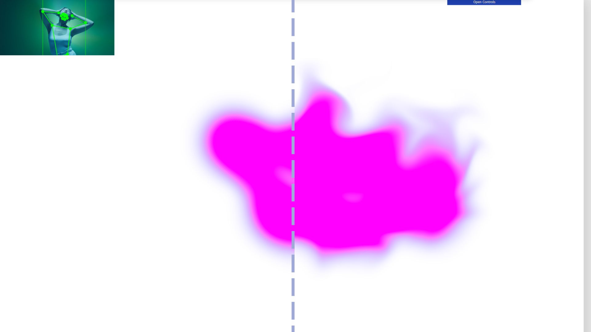
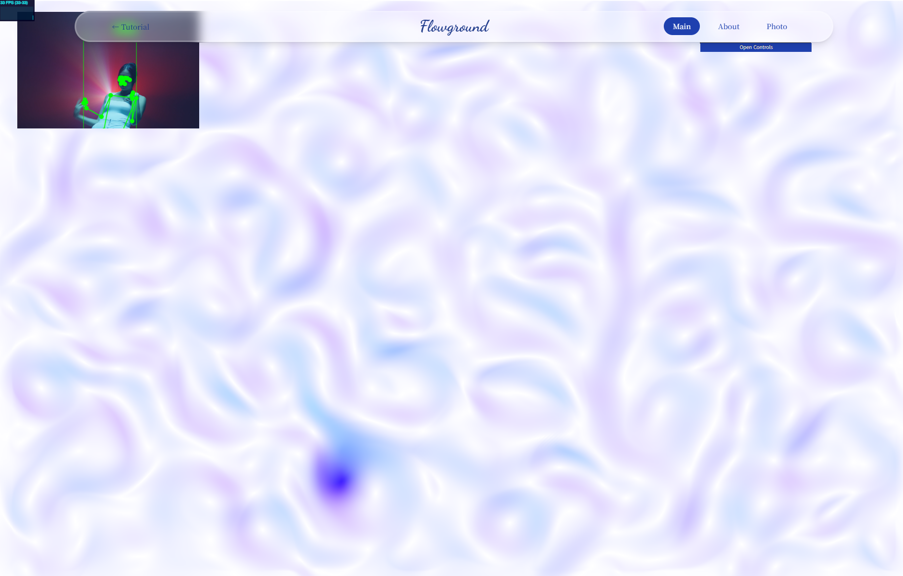
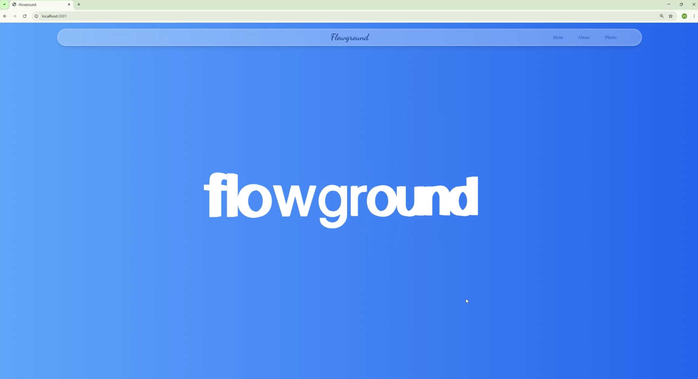
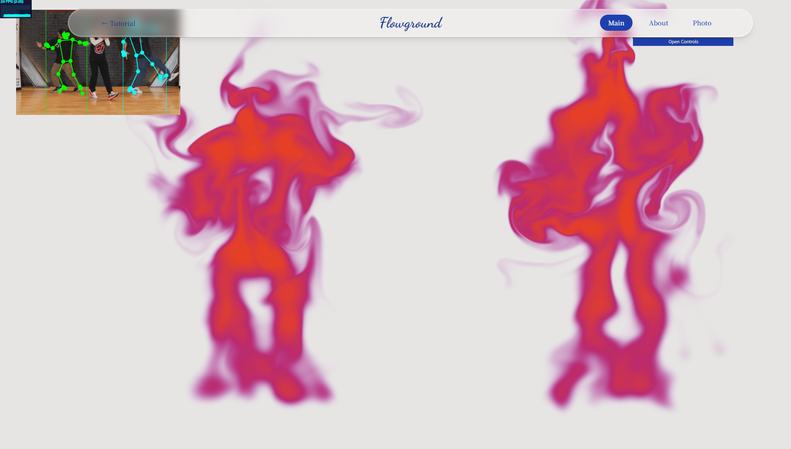
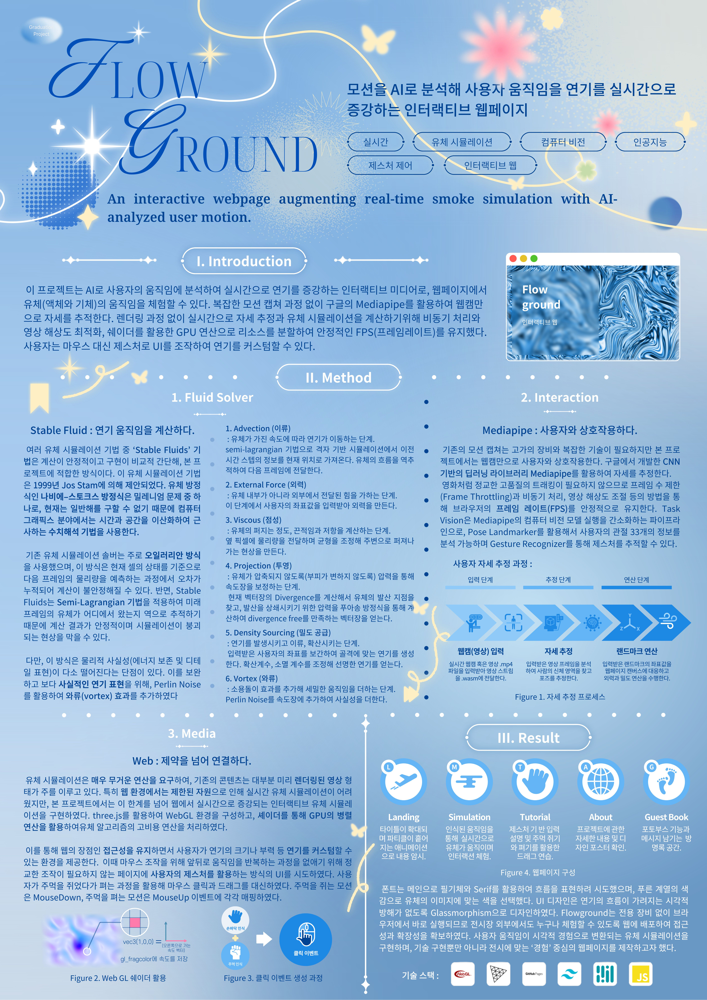

# flowground

AI 모션 분석을 통해 사용자의 움직임을 실시간 연기(유체) 시뮬레이션으로 증강하는 인터랙티브 미디어 아트워크

본 프로젝트는 졸업 전시를 위해 제작된 인터랙티브 웹페이지입니다. 기존의 마우스/키보드 기반의 단절된 조작 방식에서 벗어나, **NUI (자연스러운 사용자 인터페이스)**를 구현하는 것을 목표로 했습니다.

MediaPipe의 AI 제스처 인식을 통해 웹캠으로 사용자의 손 움직임을 분석하고, 이 데이터를 **Three.js (WebGL)**로 구현된 실시간 유체 시뮬레이션에 전달합니다. 사용자는 자신의 손짓만으로 디지털 연기를 밀고, 당기고, 소용돌이치게 만들며 직관적인 '흐름(flow)'을 경험할 수 있습니다.

---

## Framework Demo


---

## Table of Contents

1.  [핵심 아이디어 (NUI & MediaPipe)](#1-핵심-메커니즘-stable-fluids-알고리즘)
2.  [기술적 도전 (Stable Fluids)](#2-기술적-도전-사실적인-연기-구현)
3.  [페이지 워크플로우](#3-페이지-워크플로우)
4.  [졸업 전시 정보](#4-졸업전시-graduation-exhibition)
5.  [주요 기술 스택](#5-주요-기술-스택)
6.  [프로젝트 실행](#6-프로젝트-실행)
7.  [파일 구조](#7-파일-구조)

---


**핵심 기술:** 유체 역학 방정식을 안정적으로 계산하는 **'Stable Fluids'** 기법(Jos Stam, 1999)을 구현했습니다. 단순한 파티클 시스템만으로는 연기 특유의 흩날리고 섞이는 질감을 실시간 웹 환경에서 표현하기 어려웠기에 WebGL을 활용해서 유체 시뮬레이션을 구현했습니다.

## 1. 핵심 메커니즘: Stable Fluids 알고리즘

**Stable Fluids 기법 개요**

나비에-스토크스 방정식을 컴퓨터로 근사할 때, 기존 방식의 불안정성을 해결하기 위해 **Semi-Lagrangian** 기법을 사용합니다. 현재 프레임의 유체가 *어디에서 왔는지* 역으로 추적하여 계산 붕괴를 방지합니다.

**6단계 연산 프로세스**

| 단계 | 프로세스 | 역할 |
|------|---------|------|
| **1. Advection** | Semi-Lagrangian 역추적 | 유체 이동 및 속도장 전달 |
| **2. External Force** | 사용자 좌표 입력 | 손 움직임을 외력으로 변환 |
| **3. Viscous** | 확산 계산 | 점성과 저항으로 퍼지는 효과 생성 |
| **4. Projection** | 포아송 방정식 | 부피 보존 및 속도 보정 |
| **5. Density Sourcing** | 연기 생성 및 확산 | 골격 기반 연기 렌더링 |
| **6. Vortex** | Perlin Noise 추가 | 사실적인 소용돌이 효과 |

이 메커니즘은 실시간 웹 환경에서 안정성과 사실성을 동시에 보장합니다.

---


### 아이디어: Natural User Interface (NUI)


**키포인트 :** 기존 미디어 아트 작품의 상호작용은 키넥트 등의 모션 캡쳐, 센서 장치에 의해 작동합니다.
해당 프로젝트는 웹캠을 활용한 미디어아트를 구현하였으므로 별도의 장치가 필요하지 않습니다. 사용자가 공간의 제약 없이 집에서도 웹페이지를 경험할 수 있습니다.

**의의 :** 이는 접근성과 확장성 그리고 사용자화를 가능하게 합니다.
사용자는 연기의 크기나 부력 등 커스텀할 수 있습니다.

**문제 인식:**  대부분의 웹페이지는 섬세한 조작을 위해 마우스나 키보드에 의존합니다. 이는 관람객이 몰입하다가도 조작을 위해 모니터 앞으로 다가가 마우스를 잡아야 하는 경험의 단절을 유발했습니다. 하지만 해당 페이지는 섬세한 클릭이 필요하지 않으며 사용자가 위치를 유지할 때 퀄리티있는 추론 결과를 얻을 수 있기에 주먹을 쥐기-펴기 동작에 클릭 이벤트를 매핑하였습니다.



**해결 방안 (NUI):** 이 문제를 해결하기 위해 AI 손동작 인식을 도입했습니다. `GestureTracking.js`와 `VirtualMouse.js` 모듈은 웹캠으로 사용자의 손을 분석하여, 별도의 장비 없이도 직관적인 NUI 조작을 가능하게 합니다.

* 손의 위치 (`landmarks[5]`) → 가상 커서 이동
* 주먹 쥔 손 (`Closed_Fist`) → `mousedown` (잡기)
* 편 손 (`Open_Palm`) → `mouseup` (놓기)
* 쥔 채로 이동 → `mousemove` (드래그)



**기술 구현 (MediaPipe):**

* **웹캠 기반 트래킹:** Google의 CNN 기반 딥러닝 라이브러리 **MediaPipe**를 활용하여 고가 장비 없이 웹캠만으로 실시간 자세 추정을 구현합니다.
* **API 활용:** Task Vision API의 **Pose Landmarker** (관절 33개 분석)와 **Gesture Recognizer** (제스처 인식)를 사용합니다.
* **성능 최적화:** 안정적인 프레임(FPS) 유지를 위해 프레임 수 제한(Frame Throttling), 비동기 처리, 웹캠 해상도 조절 등의 최적화 기법을 적용했습니다.

---

## 2. 기술적 도전: 사실적인 연기 구현

문제 : 

* **한계 보완 (Vortex):** 다만 이 방식은 안정적인 대신 물리적 사실성(에너지 보존, 디테일)이 다소 떨어질 수 있습니다. 이를 보완하고 사실적인 연기 질감을 더하기 위해, **Perlin Noise**를 활용하여 인위적인 와류(Vortex) 효과를 추가하여 시각적 디테일을 증강시켰습니다.

### 시각적 결과

* **와류 추가 전후 연기 비교**

*Image: vortex Before & After*

* **와류가 포함된 속도 FBO 시각화**

*Image: Visualize vortex (for debug)*


---

## 3. 페이지 워크플로우

### 1. 랜딩 페이지 (Landing Page)

* **역할:** 주제 암시 및 권한 획득
* **설명:** 'flowground' 텍스트가 3D 파티클(연기 입자)로 흩어지는 인트로 애니메이션을 통해 주제('흐름')를 암시합니다. MediaPipe 사용을 위한 카메라 권한을 요청합니다.



### 2. 튜토리얼 페이지 (Tutorial / Practice Page)

* **역할:** NUI 사용법 학습 및 3D 연습
* **설명:** NUI 사용법(클릭, 드래그)을 학습한 뒤, 3D 소품샵(`shop.gltf`)이 구현된 연습 환경에서 에셋을 직접 잡고 옮겨보며 조작법을 익힙니다.


### 3. 메인 페이지 (Main Simulation Page)

* **역할:** 핵심 미디어 아트 체험
* **설명:** 본격적인 유체 시뮬레이션 공간입니다. 사용자는 이곳에서 자신의 움직임으로 연기(유체)와 자유롭게 상호작용하며 작품의 핵심 경험을 즐깁니다.



### 4. 어바웃 페이지 (About Page)

* **역할:** 프로젝트 아카이빙
* **설명:** 작품 기획 의도와 개발 과정을 담은 PPT, 공식 포스터 등 프로젝트의 상세 내용을 확인할 수 있습니다.


### 5. 방명록 페이지 (Guestbook / Photo Booth Page)

* **역할:** 소통 및 기록
* **설명:** 관람객이 방명록을 남기고, '포토 부스' 기능을 이용해 자신의 연기 형상과 함께 사진을 찍어 전시 경험을 기록할 수 있습니다.


---

## 4. 졸업 전시 (Graduation Exhibition)

* **전시 기간:** 2025년 11월 18일 ~ 11월 23일
* **전시 환경:** 전시장에서는 웹캠을 통해 실시간으로 관람객의 움직임을 분석하여 시연됩니다.



---

## 5. 주요 기술 스택


* WebGL
* GitHub Pages
* Three.js
* Tailwind CSS
* MediaPipe
* JavaScript (ES6+)

---

## 6. 프로젝트 실행

### Prerequisites

* Node.js (v16+)
* `public/asset/` 폴더에 `.gltf`, `.mp3`, `.task` 모델 파일 필요

### 1. 저장소 복제

```bash
git clone [https://github.com/your-username/flowground.git](https://github.com/your-username/flowground.git)
cd flowground
```
### 2. 의존성 설치 
```bash
npm install
``` 

### 3. 파일 구조
```js/
├── main.js                 # Webpack 진입점 및 라우터 설정
│
├── modules/                # 핵심 기능 모듈
│   ├── AssetBar.js         # 3D 연습용 에셋 바 UI
│   ├── GestureTracking.js  # [센서] MediaPipe 손 추적 (가상 마우스용)
│   ├── poseTracking.js     # [센서] MediaPipe 전신 추적 (메인 시뮬레이션용)
│   ├── tracking.worker.js  # [워커] poseTracking의 연산을 담당
│   ├── VirtualMouse.js     # [액터] 가상 커서 및 클릭 이벤트 시뮬레이터
│   ├── VideoManager.js     # 웹캠 및 권한 관리
│   └── WebGL.js            # 메인 시뮬레이션(유체) 3D 씬
│
├── pages/                  # SPA 페이지 컴포넌트
│   ├── LandingPage.js      # 3D 파티클 인트로
│   ├── TutorialPage.js     # 튜토리얼 및 3D 연습
│   ├── PracticePage.js     # (분리됨) 3D 소품샵 GLTF 로드
│   ├── AboutPage.js
│   └── PhotoBoothPage.js
│
└── utils/
    ├── EventBus.js         # 모듈 간 통신
    └── router.js           # SPA 라우터```